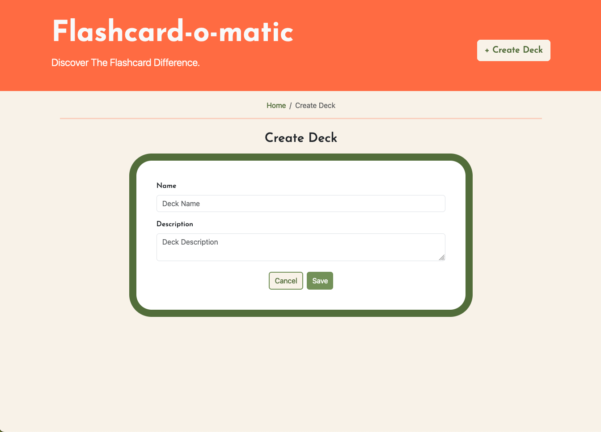
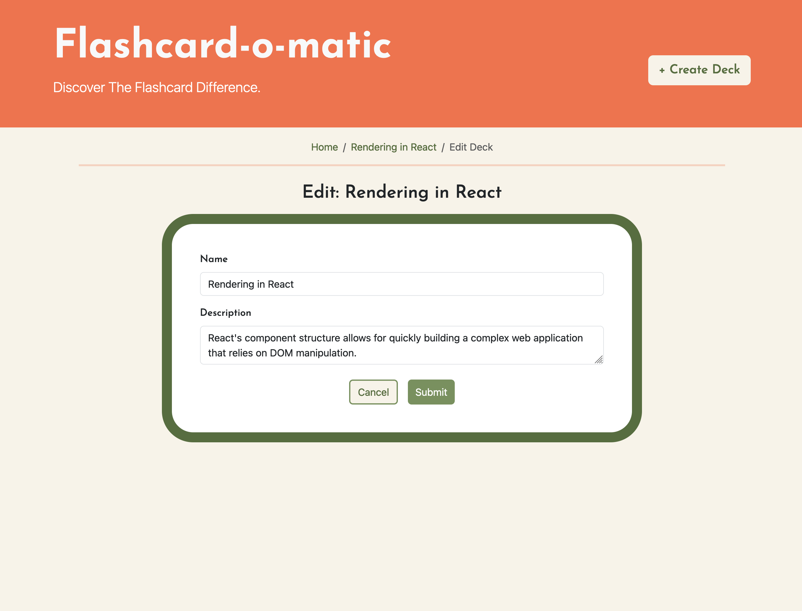

# Project: Flash-o-matic

A local school has decided to put together a flashcard application, Flashcard-o-matic, to help their students study online. Teachers will use this application to create decks of flashcards for the subjects they teach, and students will study the decks. The school needs you to build the application that the students and teachers will use.

Originally forked from Chegg Skills's starter file, this project was originally build with Bootstrap 4. Bootstrap 5 and CSS was used for the final result.

This project was originally designed to test:

- Installing packages via NPM
- Running tests from the command line
- Writing React function components
- Creating routes, including nested routes, using React Router
- Using hooks like useState(), useParams(), and useHistory()
- Debugging React code through console output and using the VS Code debugger

---

## Files

| Page        | Path                              | Description                                                                                                                                         |
| ----------- | --------------------------------- | --------------------------------------------------------------------------------------------------------------------------------------------------- |
| Home        | /                                 | Shows a list of decks with options to create, study, view, or delete a deck                                                                         |
| Study       | /decks/:deckId/study              | Allows the user to study the cards from a specified deck                                                                                            |
| Create Deck | /decks/new                        | Allows the user to create a new deck                                                                                                                |
| Deck        | /decks/:deckId                    | Shows all of the information about a specified deck with options to edit or add cards to the deck, navigate to the study screen, or delete the deck |
| Edit Deck   | /decks/:deckId/edit               | Allows the user to modify information on an existing deck                                                                                           |
| Add Card    | /decks/:deckId/cards/new          | Allows the user to add a new card to an existing deck                                                                                               |
| Edit Card   | /decks/:deckId/cards/:cardId/edit | Allows the user to modify information on an existing card                                                                                           |

---

### Home

 

- `Create Deck` button links to /decks/new where there is a form for the Name and Description the deck to be created.
- `View` button links to /decks/:deckId, where the deck's cards are visible
- `Study` button links to /decks/:deckId/study, where the front of each card will be shown and can be flipped to show the back. Go through each card and a pop up will give the option to start over or return to the previous page
- `Delete` button will delete the deck. A pop up will be triggered to confirm the user wishes to delete the deck.

### Study

- A breadcrumb navigation bar allows the user to access the home page, deck's page, and displays the text "Study"
- The name of the deck
- The top of the card shows what number card the user is on out of total number of cards.
- The front of the first card will be shown. The flip button will show the back of that card and Next button will advance to the next card.
- When the next button is clicked on the last card, a pop up will appear asking if the user wants to restart studying the deck or to return to the previous page.
- If there are not enough cards (less than 3), the page will inform the user that there needs to be more cards in the deck and how many cards are currently in the deck.

### Create Deck

- A breadcrumb navigation bar allows the user to access the home page and displays the text "Create Deck"
- A form for the user to enter the Name and Description of the deck
- `Cancel` will return user to the Home page
- `Save` creates the deck and takes user to the new deck's page
- Shares a form component with the Edit Deck page

### Deck

- A breadcrumb navigation bar allows the user to access the home page and displays the deck's name
- The deck's name and description are displayed
- The `Edit` button links to /decks/:deckId/edit and allows the user to edit the Name and Description
- The `Study` button links to /decks/:deckId/Study and allows the user to study the deck
- The `Add Cards` button links to /decks/:deckId/cards/new and allows the user to enter a card's front and back information into a form
- The `Delete` button deletes the deck and returns the user to the Home page
- All the cards in the deck are displayed along with an edit and delete button
- Each card's `Edit` button leads to /decks/:deckId/cards/:cardId/edit and allows the user to edit the front and back of the selected card
- Each card's `Delete` button will delete the card from the deck. A pop up will appear asking the user to confirm.

### Edit Deck

- A breadcrumb navigation bar allows the user to access the home page, the deck being edited, and displays the text 'Edit Deck'
- A form for the user to change the Name and Description of the deck
- Cancel will return user to the deck's page unedited
- Shares a form component with the New Deck page but with the Name and Description of the deck already populated in the form
- `Cancel` will return user to the deck's page
- `Save` creates the deck and takes user to the deck's page

### Add Card

- A breadcrumb navigation bar allows the user to access the home page, the deck the card is being added to, and displays the text "Add Card"
- A form for the user to enter the text Front and Back side of the card
- Shares a form component with Edit Card
- The `Done` button returns the user to the deck's page
- The `Save` button adds the card to the deck and clears the contents of the form

### Edit Card

- A breadcrumb navigation bar allows the user to access the home page, the deck the card belongs to, and displays "Edit Card" along with the card's id
- A form for the user to edit the text Front and Back side of the card
- Shares a form component with Edit Card but with the card's Front and Back text already populated in the form
- The `Done` button returns the user to the deck's page with the card unchanged
- The `Save` button saves the changes to the card and returns the user to the deck's page
